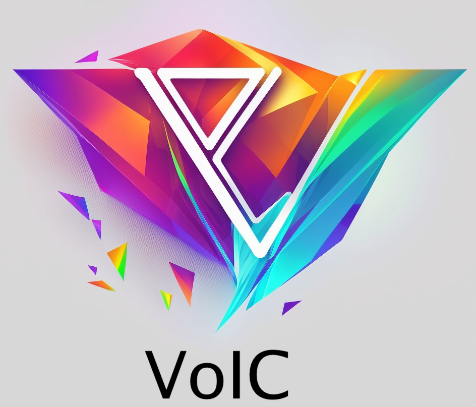

# VoIC



VoIC is a module and set of examples that can be used to build VoIC compliant DAOs that run on ICDev's VoIC site.

## The component - voic.mo:

Construtor:

```
public type Options = {
  axonCanister: Principal; // canister that holds the axon your are managing
  axonId : Nat; //ID of the managed axon
  voiceTarget: Principal; //wallet canister(proxy) of your axon
  icp_fee: ?Nat64; //fee for ICP transfers (defaults to 10000)
};
```

```
public func process(buffer: Buffer.Buffer<Types.BatchOp>) : async* Result.Result<Types.AxonCommandExecution, Types.AxonError>

public type BatchOp = {
  #Mint:{owner : ?Principal; amount :Nat};
  #Burn:{owner: Principal; amount : ?Nat};
  #Balance:{owner: Principal; amount : Nat};
};
```

Process a set of batch ops(burn and mints). This allows the canister that is set a minter on the DAO to update balances based on inputs.  Use #Balance as opposed to #Burn then #Mint to minimize transactions on the ledger and/or if the previous balance is unknown to your contract and you want to update the balance to an absolute amount.

```
public func icrc1_seed(owner: Principal, subaccounts: [[Nat8]]) : async* Result.Result<Types.AxonCommandExecution, Types.AxonError>
```

Seeds an ICRC1 account by scanning all provided subaccounts for a principal and setting the balance for that principal to the final total.

```
public func dip20_seed(owner: Principal, subaccounts: [[Nat8]]) : async* Result.Result<Types.AxonCommandExecution, Types.AxonError>
```

Seeds an DIP account to a particular balance. Dip20 accounts don't have sub accounts.


```
public func ogynft_seed(owner: Principal, balance: Nat) : async* Result.Result<Types.AxonCommandExecution, Types.AxonError>{
```

Seeds an origyn_nft account to a particular balance. While Origyn NFTs can support accounts, they typically do not and operate on principals.

```
public func mint(owner: Principal, amount: Nat) : async* Result.Result<Types.AxonCommandExecution, Types.AxonError>
```

Mints new tokens to a principal.

```
public func burn(owner: Principal, amount: Nat) : async* Result.Result<Types.AxonCommandExecution, Types.AxonError>
```

Burns tokens from a principal.

```
public func transfer(from_owner: Principal, to_owner:Principal, amount: Nat) : async* Result.Result<Types.AxonCommandExecution, Types.AxonError>
```

Moves tokens from one account to another via mint and burn. Useful when scanning transaction logs.

```
public func get_delegation_info(caller: ?Principal, follower: ICRCTypes.Account, canister: Principal, fee: Nat) : Types.DelegationInfo

public type DelegationInfo = {
        delegationAccount :  ?{ 
          follower : Principal;
          followee : Principal;
          account : ICRCTypes.Account;
          address_legacy_blob : Blob;
          address_legacy_text : Text;
          address_text: Text;

        };
        removalAccount : {
          follower: Principal;
          account: ICRCTypes.Account;
          address_legacy_blob : Blob;
          address_legacy_text : Text;
          address_text: Text;
        };
        fee : Nat;
      };
```

Returns the account info that a user can send ICP to create a delegation from one Principal to another.

```
public func process_delegation(caller: ?Principal, follower: ICRCTypes.Account, block: Nat64, canister: Principal, fee: Nat): async* Result.Result<Bool, Text>
```

Process the delegation payment and moves the fee to the ICDevs account. This account will pay for gas for the services and donate excess to the ICDevs general Treasury that is used for developing software on the IC.

## The examples

### examples/icrc/icrc.mo

This example can be used with ICRC-1 compliant ledgers that also expose blocks in the same manner as SNS-1. This is not a final format, but seems to be working for now and I assume that future SNS tokens will use it as well.

Ever X seconds it checks for new transactions and mints and burns differences.

### examples/icrc/icrclegacy.mo

This example can be used with legacy ICRC-1 ledgers that use the old query blocks functionality. This includes ICP and OGY.  Since principals are not in the history, we can only load accounts that let us know their sub accounts.

Ever X seconds it checks for new transactions and mints and burns differences.

### examples/dip20.mo

This example can be used with dip20 coins like YourCoin. Since the transaction history for YourCoin is corrupted we use the getHolders method and refresh ever X Seconds.  Only changes in balance should be reflected.  This is very chatty and we'll try to upgrade once they get a sustainable and "build from genesis" transaction log.

### examples/origyn_nft.mo

This example can be used with origyn_nft v0.1.3 and higher. Every X Seconds we poll for the unique set of holders and their balance. This would be very chatty for large collections and might eventually hit the 2MB limit. Eventually we will integrate this with the origyn_nft event system so that changes are more atomic.

## The UI

The UI is hosted at https://github.com/icdevs/axon in the voic branch. Please feel free to make improvements and file pull requests.  There are already a number of issues that have been filed that bring quality of life improvements.


